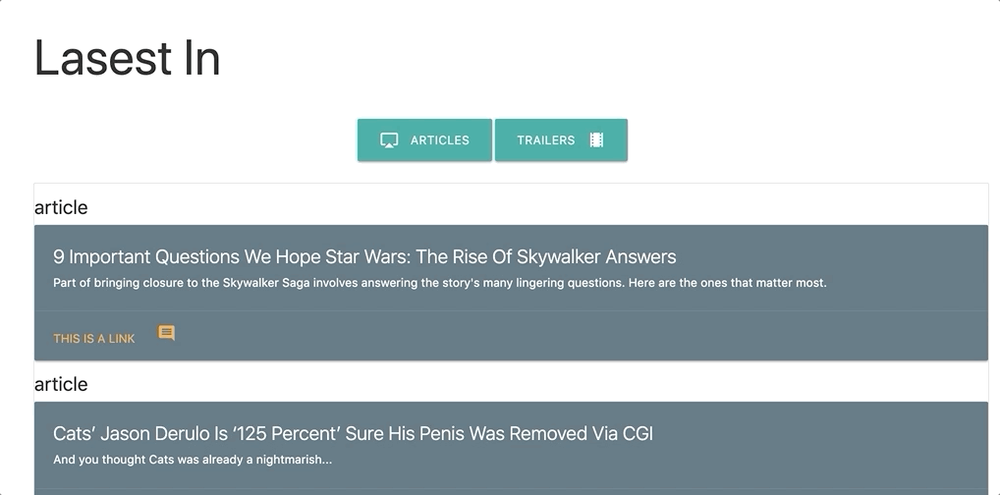

# LatestInNews
View the lastest in news and express your opinion 

## MVP
  - [X] Use the all 5  
    - [X] Express
    - [X] Express-handlebars
    - [X] Mongoose
    - [X] Cheerio
    - [X] Axios
  - [X] Deploy to Heroku
  - [X] Set up MLab provision  
  - [X] Scrape Stories from a news outlet to Database
    - [X] Headline
    - [X] Summary
    - [X] URL
    - [X] Additional content
  - [X] User able to leave comments saved to Database
  - [X] User able to delete comments 
  - [X] User able to view all comments
  

## Developmental Features
  - [ ] Show dates for comments
  - [ ] Users login
  - [ ] Edit comments
  - [ ] Save posts
  

## Technologies USe
  - [Express](https://www.npmjs.com/package/express)
  - [Express-handlebars](https://www.npmjs.com/package/express-handlebars)
  - [Mongoose](https://www.npmjs.com/package/mongoose)
  - [Cheerio](https://www.npmjs.com/package/cheerio)
  - [Axios](https://www.npmjs.com/search?q=axios)
  - [Materialize](https://materializecss.com/)

## Usage
- [Open App](https://intense-brook-89930.herokuapp.com/)
- Browse movie articles and trailers
  > 
- Select post you want to comment on
  > 
- Enter Comment
  > 
- Come back later to review or delete your comment
  > 
